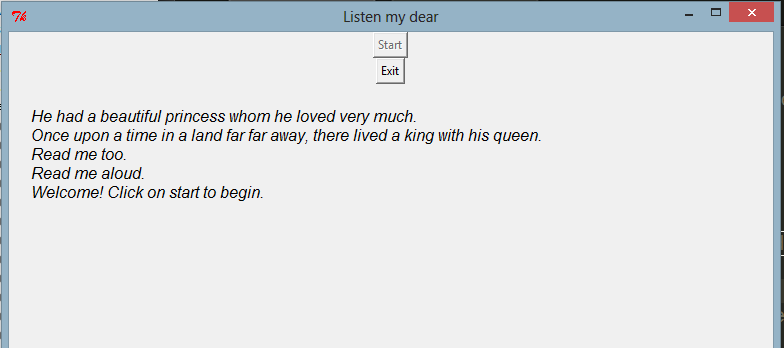

# ReadMeAloud
Simple GUI program to read a text file while showing what is being read.
Copy paste whatever you want to read in text.txt file. And run the program, it reads line by line. The new line is added above what is already read.

##Requirement
* Python 2.5+ (not checked for others.)
* pyttsx (pip install pyttsx)

##Screenshot

